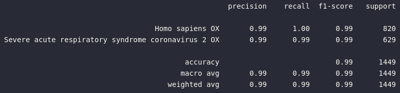
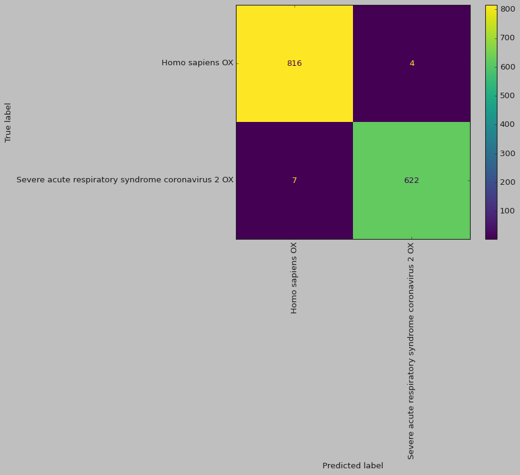

# Sars-Cov2 Protein Classification

## Introduction
The objective of this project was to identify the protein sequence of COVID-19 suspect.

## Method
LightGBM Classifier with bayesian optimization over hyper parameters and elastic net as feature selection algorithm were use to classify the protein sequence.

## Result
The model performance achieved 99% accuracy.

### Classification Report

### Confusion Matrix
